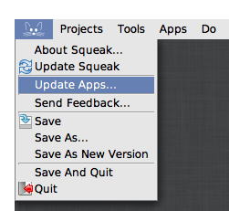
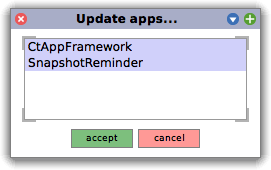

# squeak-appframework

Tiny framework for Squeak apps that can be updated via Metacello and receive feedback on GitHub

[](https://github.com/search?q=%2Fbaseline%3A+%27CtAppFramework%27%5Cs*with%3A%2F+path%3ABaselineOf&ref=opensearch&type=code)

## Installation

### Standalone

```smalltalk
Metacello new
	baseline: 'CtAppFramework';
	repository: 'github://LinqLover/squeak-appframework:main';
	get; "for updates"
	load.
```

### As a Metacello Dependency

```smalltalk
spec
	baseline: 'CtAppFramework' with:
		[spec repository: 'github://LinqLover/squeak-appframework:main'].

"..."

spec group: #recommended with: #('CtAppFramework').
spec group: #withRecommended with: #(default recommended).
```

---

After installation, you need to hide and show the world main docking bar again (via yellow-click into the world > `show main docking bar`) to include the new update item into the main menu.

## Update Apps

In the world main docking bar, open the main menu (Squeak icon) and click on `Update apps...`.

 

## Framework

To participate in the framework, override at least `#selfUpdate` or `#githubRepositoryParams` in the main class in your project. To use the provided app menu, send `#appMenu:` to your app class. See the comment in [`CtAppFramework`](./packages/CtAppFramework/CtAppFramework.class.st) for more details.
